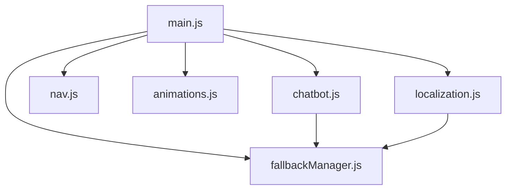
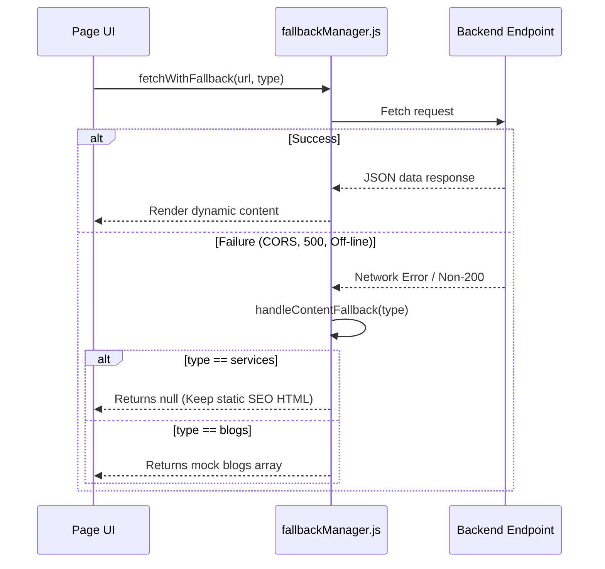

# AGNEX Technology Project Documentation

This document serves as the comprehensive technical documentation for the **AGNEX Technology** corporate website. It details the site's architecture, directory structure, individual pages, style sheets, front-end scripts, forms validation, interactive modules (AI chatbot, localization, and GDPR consent), and system fallback mechanisms.

---

## 1. Project Overview & Tech Stack

AGNEX Technology is a premium software engineering agency website that presents services, a portfolio of projects, blog insights, and careers. The web application is engineered around high performance, accessibility, responsiveness, and resilient offline-first/fallback structures.

### Core Technologies
*   **HTML5** & **Handlebars**: Structuring and templating engine using partials for high reuse.
*   **Vite**: Fast frontend build tool and development server.
*   **Vanilla CSS**: Custom styling system utilizing variables for styling flexibility and high performance.
*   **Vanilla JavaScript**: Module-based frontend architecture handling animations, localization, fallback management, forms, and interactive AI chatbot.
*   **Jest & JSDOM**: Automation tests suite to verify local fallback behaviors.

---

## 2. Directory & File Structure

Below is the directory map of the AGNEX Technology website:

| Path | Type | Purpose / Content Description |
| :--- | :--- | :--- |
| `.` | Directory | Root workspace folder containing configurations and entry files |
| ├── [package.json](file:///c:/Users/santh/Downloads/web-vantrex/package.json) | File | Node project configuration, dependency definitions, and scripts |
| ├── [vite.config.js](file:///c:/Users/santh/Downloads/web-vantrex/vite.config.js) | File | Vite bundler config with Handlebars partials and multi-page build routing |
| ├── [style.css](file:///c:/Users/santh/Downloads/web-vantrex/style.css) | File | Central stylesheet, design tokens, styles, layout classes, light/dark themes |
| ├── [form.js](file:///c:/Users/santh/Downloads/web-vantrex/form.js) | File | Direct handler script for the contact form |
| ├── [FALLBACKS.md](file:///c:/Users/santh/Downloads/web-vantrex/FALLBACKS.md) | File | Documentation of hardcoded frontend fallback mechanisms |
| ├── [LOCALIZATION_WORKFLOW.md](file:///c:/Users/santh/Downloads/web-vantrex/LOCALIZATION_WORKFLOW.md) | File | Workflow guide on data-attribute-driven translations |
| ├── [index.html](file:///c:/Users/santh/Downloads/web-vantrex/index.html) | File | Home/Landing page template |
| ├── `about/` | Directory | About page directory |
| │   └── [index.html](file:///c:/Users/santh/Downloads/web-vantrex/about/index.html) | File | About page template |
| ├── `services/` | Directory | Services page directory |
| │   └── [index.html](file:///c:/Users/santh/Downloads/web-vantrex/services/index.html) | File | Services list template |
| ├── `portfolio/` | Directory | Portfolio page directory |
| │   └── [index.html](file:///c:/Users/santh/Downloads/web-vantrex/portfolio/index.html) | File | Portfolio showcase and case modal template |
| ├── `blog/` | Directory | Blog insights page directory |
| │   └── [index.html](file:///c:/Users/santh/Downloads/web-vantrex/blog/index.html) | File | Blog posts grid template |
| ├── `careers/` | Directory | Careers page directory |
| │   └── [index.html](file:///c:/Users/santh/Downloads/web-vantrex/careers/index.html) | File | Openings list and application form template |
| ├── `contact/` | Directory | Contact page directory |
| │   └── [index.html](file:///c:/Users/santh/Downloads/web-vantrex/contact/index.html) | File | Standardized contact form page |
| ├── `privacy/` | Directory | Privacy policy folder |
| │   └── [index.html](file:///c:/Users/santh/Downloads/web-vantrex/privacy/index.html) | File | Privacy terms details page |
| ├── `terms/` | Directory | Terms of service folder |
| │   └── [index.html](file:///c:/Users/santh/Downloads/web-vantrex/terms/index.html) | File | Terms and conditions details page |
| ├── `partials/` | Directory | Reusable HTML templates injected during compilation |
| │   ├── [head.html](file:///c:/Users/santh/Downloads/web-vantrex/partials/head.html) | File | SEO tags, fonts connection, CSS imports, and script security policies |
| │   ├── [navbar.html](file:///c:/Users/santh/Downloads/web-vantrex/partials/navbar.html) | File | Common navigation bar, preloader, background decorations, selectors |
| │   └── [footer.html](file:///c:/Users/santh/Downloads/web-vantrex/partials/footer.html) | File | Common footer, AI chatbot panel, GDPR cookies dialog, back-to-top |
| ├── `js/` | Directory | JavaScript modules directory |
| │   ├── [main.js](file:///c:/Users/santh/Downloads/web-vantrex/js/main.js) | File | Primary entry point orchestrating modular features initialization |
| │   ├── [fallbackManager.js](file:///c:/Users/santh/Downloads/web-vantrex/js/fallbackManager.js) | File | Fallback data mapping and error interception mechanisms |
| │   ├── [localization.js](file:///c:/Users/santh/Downloads/web-vantrex/js/localization.js) | File | Bilingual dictionary loading and DOM text string interpolation |
| │   ├── [chatbot.js](file:///c:/Users/santh/Downloads/web-vantrex/js/chatbot.js) | File | Interactive chatbot interface, sessionStorage, and GDPR module |
| │   ├── [animations.js](file:///c:/Users/santh/Downloads/web-vantrex/js/animations.js) | File | Parallax hover, scrolling intersection observer, ripples, and 3D tilts |
| │   └── [nav.js](file:///c:/Users/santh/Downloads/web-vantrex/js/nav.js) | File | Sticky nav, smooth scrolling, mobile nav panel, and page tracking |
| ├── `public/` | Directory | Static files served directly (images, dictionaries, chatbot rules) |
| │   ├── `config/` | Directory | JSON rule configs |
| │   │   └── [chatbotFallbackRules.json](file:///c:/Users/santh/Downloads/web-vantrex/public/config/chatbotFallbackRules.json) | File | Bilingual regex expressions & responses definitions for chatbot |
| │   ├── `lang/` | Directory | JSON translation files |
| │   │   ├── [en.json](file:///c:/Users/santh/Downloads/web-vantrex/public/lang/en.json) | File | English translation dictionary |
| │   │   └── [ta.json](file:///c:/Users/santh/Downloads/web-vantrex/public/lang/ta.json) | File | Tamil translation dictionary |
| └── `tests/` | Directory | Verification scripts |
|     └── [fallback.test.js](file:///c:/Users/santh/Downloads/web-vantrex/tests/fallback.test.js) | File | Jest testing script validating FallbackManager interfaces |

---

## 3. Build & Development Workflow

The project uses `vite` as its development environment and asset bundler. 

### Package Scripts
The following commands are defined in [package.json](file:///c:/Users/santh/Downloads/web-vantrex/package.json):
*   `npm run dev`: Launches the local Vite server with Hot Module Replacement (HMR).
*   `npm run build`: Compiles optimized production bundle assets under the `dist/` directory.
*   `npm run preview`: Previews the production-compiled build locally.
*   `npm run test`: Executes the Jest test runner environment to run test files.

### Template Compilation (Handlebars integration)
Vite integrates `vite-plugin-handlebars` via [vite.config.js](file:///c:/Users/santh/Downloads/web-vantrex/vite.config.js). During execution and build time, Handlebars directives (e.g. `{{> navbar}}` or `{{> head title="..."}}`) are evaluated:
*   Partials are fetched from the `partials/` folder.
*   Dynamic parameter attributes (like Title, Description, Path) are injected into the respective templates during building.
*   Rollup compiles and targets pages separately as configured in `build.rollupOptions.input`.

---

## 4. Pages & Templates

### 4.1 Partials (Reusable Layout Parts)
*   **[head.html](file:///c:/Users/santh/Downloads/web-vantrex/partials/head.html)**:
    Includes charset, viewport, title, description, and canonical path link. It injects alternate language tags (`hreflang="en"` and `hreflang="ta"`). It establishes a rigid Content-Security-Policy (CSP) to restrict scripts and connections, loads Montserrat and Poppins fonts, registers FontAwesome, and runs a small script blocker that checks `localStorage` for dark theme to block FOUC (Flash of Unstyled Content).
*   **[navbar.html](file:///c:/Users/santh/Downloads/web-vantrex/partials/navbar.html)**:
    Includes the page loading preloader screen, visual background gradient decoration orbs, the main header navigation menu containing the page router links, a glob globe language switcher dropdown (English/தமிழ்), and a light/dark theme toggler button.
*   **[footer.html](file:///c:/Users/santh/Downloads/web-vantrex/partials/footer.html)**:
    Houses footer details (brand message, site link tree, social profiles), the floating AI Chatbot pane (`chatbotContainer`), the bottom GDPR Cookies consent banner, the Back to Top indicator, and imports deferred main scripts.

### 4.2 Application Pages
*   **Home/Landing ([index.html](file:///c:/Users/santh/Downloads/web-vantrex/index.html))**:
    Includes a greeting section displaying local time-based welcome phrases, hero header elements with a mouse-controlled translation parallax shape, a list of brand competitive highlights (Proven Expertise, Agile Delivery, Scalable Architecture), and a custom client testimonial card carousel.
*   **About Us ([about/index.html](file:///c:/Users/santh/Downloads/web-vantrex/about/index.html))**:
    Introduces the core engineering team image, mission statement, vision milestones, and key quality cards (Reliability, Innovation, Customer Satisfaction, Quality Delivery).
*   **Services ([services/index.html](file:///c:/Users/santh/Downloads/web-vantrex/services/index.html))**:
    Houses the services grid element (`#servicesGrid`) containing three primary offerings: Web Development, Mobile Apps Development, and Custom Systems Development. Supports async backend fetching with an inline static HTML fallback.
*   **Portfolio Showcase ([portfolio/index.html](file:///c:/Users/santh/Downloads/web-vantrex/portfolio/index.html))**:
    Showcases completed applications (Facility Lifecycle Manager, Seamless Reserve App, Corporate Digital Portals, Dynamic Inventory Sync) and includes an accessibility modal component (`#caseModal`) to preview project detail case studies dynamically.
*   **Blog Insights ([blog/index.html](file:///c:/Users/santh/Downloads/web-vantrex/blog/index.html))**:
    A template containing the articles container (`#blogsGrid`), dynamically populated on page load from the content API, with a fallback rendering mechanism.
*   **Careers ([careers/index.html](file:///c:/Users/santh/Downloads/web-vantrex/careers/index.html))**:
    Lists current open positions and includes a mock job application handler form (`#careersForm`) requiring candidate particulars, email, and portfolio URLs.
*   **Contact Us ([contact/index.html](file:///c:/Users/santh/Downloads/web-vantrex/contact/index.html))**:
    A standalone layout featuring direct contact channels (Namakkal, support email, phone number) and a standardized client request intake form (`#contactForm`).

---

## 5. Front-end Scripts Architecture

The application logic is written in modular ES6 Javascript.

### 5.1 [main.js](file:///c:/Users/santh/Downloads/web-vantrex/js/main.js)
The core script orchestrating structural initialization. It runs on `DOMContentLoaded` and sequentially registers components:
1.  **Localization**: Initializes bilingual data-attributes translation (`await initLocalization()`).
2.  **Navigation**: Triggers scrolling effects, dynamic link updates, and toggle events.
3.  **Animations**: Mounts intersection observers and hover properties.
4.  **Chatbot & GDPR**: Sets up cookie checks, privacy dialog handlers, and chat logs.
5.  **Testimonials Slider**: Runs slide calculations, dots generation, user control events, and a 5-second automatic sliding loop.
6.  **Theme Toggle**: Accesses local storage to toggle class `.dark-theme` on the body.
7.  **Dynamic Content Loading**: Calls asynchronous API fetches for services grid and blog articles.
8.  **Portfolio Modal**: Opens `#caseModal` and renders details according to the hovered card metadata.

### 5.2 [fallbackManager.js](file:///c:/Users/santh/Downloads/web-vantrex/js/fallbackManager.js)
A utility managing network outages or server request failures:
*   `fetchWithFallback(url, fallbackType)`: Fetches data asynchronously. If an error is caught (server offline or cross-origin failure), it executes `handleContentFallback(fallbackType)`.
*   `handleContentFallback(type)`:
    *   `services`: Returns `null`, indicating that the caller should keep the statically baked, SEO-friendly HTML services grid intact.
    *   `blogs`: Returns three mock posts containing technical article details.
*   `handleChatbotFallback(query, rules, currentLang)`: Matches keywords against rule structures to return correct Tamil/English static strings. Falls back to a generic CTA contact message if no matches are found.
*   `handleLocalizationFallback(lang, errorPath)`: Gracefully returns an empty dictionary `{}` to prevent injection crashes, and fires a developer-facing error banner if hosted on `localhost`.

### 5.3 [localization.js](file:///c:/Users/santh/Downloads/web-vantrex/js/localization.js)
Operates translations on the client-side:
*   Asynchronously fetches `/lang/en.json` or `/lang/ta.json`.
*   Crawls the DOM for tags bearing `[data-i18n]`.
*   Interpolates values from dictionaries. If translation strings contain HTML tokens or headings, it utilizes `innerHTML` overrides; otherwise, it assigns `textContent`.
*   Calculates the local hour to inject a time-appropriate greeting (Good Morning/Afternoon/Evening) in English or Tamil.
*   Binds event handlers to the dropdown buttons.

### 5.4 [chatbot.js](file:///c:/Users/santh/Downloads/web-vantrex/js/chatbot.js)
Responsible for interactive AI assistant services and compliance settings:
*   Loads `/config/chatbotFallbackRules.json` on start.
*   Tracks user hover actions across `.service-card` elements to update context prompts.
*   Binds quick chip recommendation actions.
*   Appends user messages to `#chatbotMessages` and queries the fallback engine.
*   Manages a fake typing delay indicator.
*   Saves active session messages inside `sessionStorage` and restores history on panel toggle.
*   Executes `initGDPR()` to check for `cookieConsent` in local storage, launches the preference settings modal on delay if not found, and traps keyboard focus inside the settings banner for accessibility.

### 5.5 [animations.js](file:///c:/Users/santh/Downloads/web-vantrex/js/animations.js)
Handles visual enhancements:
*   Caches user motion accessibility configurations using `prefers-reduced-motion`.
*   Registers an `IntersectionObserver` on `.fade-in` elements.
*   Controls a 2D mouse parallax translation on the hero background shape.
*   Binds mouse coordinate computations on `.service-card`, `.portfolio-item`, `.mv-card`, and `.blog-card` to render a 3D rotating perspective effect.
*   Appends floating CSS elements on `.btn-primary` and `.btn-secondary` inputs to display a ripple click wave.

### 5.6 [nav.js](file:///c:/Users/santh/Downloads/web-vantrex/js/nav.js)
Oversees header positioning and indicators:
*   Attaches scrolling listeners to the navbar element, appending class `.scrolled` when window offset exceeds 50px.
*   Intercepts anchor URLs (`href^="#"`) to perform smooth scrolling transitions.
*   Binds touch events to the hamburger button to slide open mobile navigation drawers.
*   Compares location path segments to append class `.active` to current navbar links.
*   Brings up the scroll-to-top button when scrolling down.

### 5.7 [form.js](file:///c:/Users/santh/Downloads/web-vantrex/form.js)
Dedicated handler file validation and dispatching for the primary contact page:
*   Intercepts submit events and validates honeypot fields to block spambots.
*   Clears whitespace and performs regex validations on telephone entries (accepts Indian `+91` prefix variations and 10-digit formats).
*   Enters loading state ("Sending...") and fires a POST request carrying name, phone, and requirements data to `/api/contact`.
*   If the server responds successfully, it prints a success banner and triggers a Google Analytics lead event (`generate_lead`).
*   On error, it exposes a retry button that allows the user to re-enable inputs.

---

## 6. Style System & Design Tokens

The styling is written in raw CSS using modern design tokens defined in the `:root` pseudo-class.

### CSS Design Tokens
| Token Variable | Light Theme (Default) | Dark Theme (`.dark-theme`) |
| :--- | :--- | :--- |
| `--primary-color` | `#ff5500` (Neon Orange-Red) | `#ff5500` (Neon Orange-Red) |
| `--bg-main` | `#fdfdfd` | `#070913` (Ultra deep blue-black) |
| `--bg-section` | `#f8f9fa` | `#0c0f1d` (slate-950) |
| `--text-main` | `#1e293b` (slate-800) | `#f1f5f9` (slate-100) |
| `--text-muted` | `#64748b` (slate-500) | `#94a3b8` (slate-400) |
| `--heading-color` | `#0f172a` (slate-900) | `#ffffff` (Absolute white) |
| `--navbar-bg` | `rgba(255, 255, 255, 0.7)` | `rgba(7, 9, 19, 0.75)` |
| `--card-bg` | Glassmorphic white gradients | Glassmorphic dark gradients |
| `--card-shadow` | Soft shadow (`rgba(0,0,0,0.04)`) | Heavy shadows (`rgba(0,0,0,0.4)`) |
| `--card-hover-shadow` | Light orange glow | Rich orange-red glow |

### Radial Background Gradients
The body background uses dynamic CSS radial gradients positioned at different coordinates. They are fixed to the viewport (`background-attachment: fixed`), creating a smooth parallax transition as the user scrolls.

---

## 7. System Resilience & Fallbacks

> [!IMPORTANT]
> The site's frontend is designed to be highly resilient. Under network or API failure scenarios, the application degrades gracefully to maintain full functionality.

### 7.1 Services API Degradation
If the server endpoint `/api/content/services` fails, the exception is caught, and `null` is returned. The script checks for this null value and aborts DOM modifications. This leaves the default semantic HTML nodes inside `#servicesGrid` intact, ensuring that search engines and users can still read about the primary services.

### 7.2 Blog Posts Degradation
If the blog post API fails to return actual articles, the script falls back to rendering mock blog data:
1.  *Architecting Modern High-Performance API Gateways* (by `tech-team@agnex.tech`)
2.  *Why We Chose Clean Architecture for Node.js Services* (by `engineering@agnex.tech`)
3.  *Maximizing UX Performance with Micro-Animations* (by `ux-team@agnex.tech`)

### 7.3 Chatbot NLP Engine
If a backend LLM/AI model is unavailable, the chatbot uses rules defined in [chatbotFallbackRules.json](file:///c:/Users/santh/Downloads/web-vantrex/public/config/chatbotFallbackRules.json) to answer user questions. It uses keywords in both English and Tamil to match user inputs:

*   **Services query** (`service`, `சேவை`, `மென்பொருள்`): Tells the user about Web Development, Mobile Apps, and Custom ERP platforms.
*   **Location query** (`location`, `office`, `namakkal`, `நாமக்கல்`, `முகவரி`): Returns the office address on Namakkal Main Road, open Monday through Saturday (9 AM - 6 PM).
*   **Pricing query** (`quote`, `price`, `cost`, `விலை`, `மதிப்பீடு`): Informs about starting prices (websites from ₹25,000, custom ERPs from ₹1,50,000).
*   **Contact query** (`contact`, `team`, `email`, `phone`, `தொடர்பு`): Provides phone number and support email address.
*   **Greeting query** (`hello`, `hi`, `வணக்கம்`): Greets the user and lists what topics they can ask about.
*   **Default query**: Suggests submitting a request using the contact form or sending an email.

---

## 8. Test Suite Details

Automated unit testing is configured using Jest and JSDOM, implemented in [fallback.test.js](file:///c:/Users/santh/Downloads/web-vantrex/tests/fallback.test.js).

### Verified Test Paths
1.  **fetchWithFallback Successful Fetch**: Confirms that when the fetch response is successful (`ok: true`), the JSON payload is returned.
2.  **fetchWithFallback Network failure**: Validates that when a network failure occurs, a warning is logged, and `handleContentFallback` is called.
3.  **fetchWithFallback HTTP non-200**: Verifies that when a status error (e.g. 500 Server Error) occurs, it triggers the fallback code.
4.  **handleContentFallback Services**: Ensures `null` is returned for services so that the static DOM contents are preserved.
5.  **handleContentFallback Blogs**: Validates that the returned fallback object contains three mock blog posts with correct titles.
6.  **handleChatbotFallback Bilingual matching**:
    *   Asserts English keywords match English responses.
    *   Asserts Tamil keywords match Tamil translations.
    *   Validates default catch-all statements containing HTML links.
7.  **handleLocalizationFallback Recovery**: Asserts that an empty translation dictionary `{}` is returned on fetch failure and a developer notification is shown on `localhost`.
